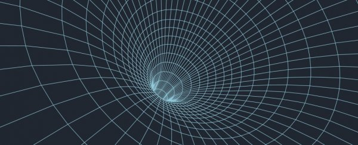
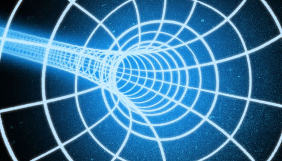
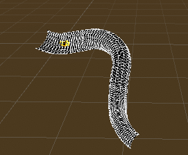
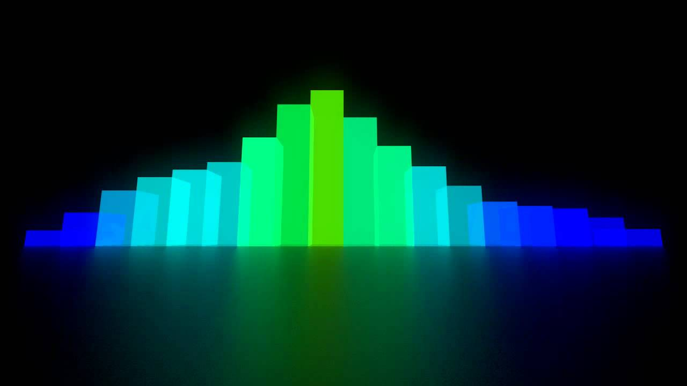
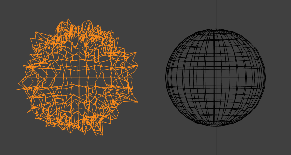
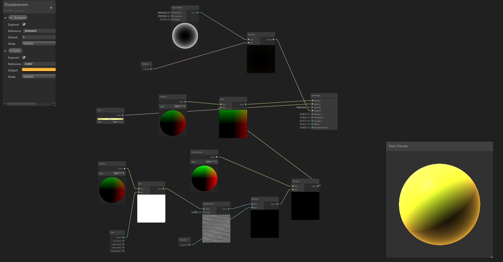
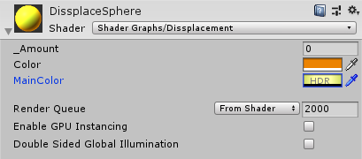
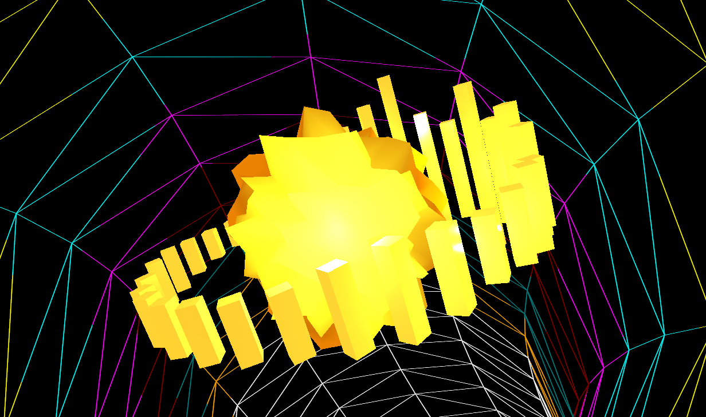

# GameEngines
 Repo for GameEngines1
 
**Controls**

Use _A_ and _D_ to rotate the camera.

Use _W_ and _S_ to rotate the audio cubes.

Press _Space_ to create particle effects.

(_Also works with controllers just use horizontal and vertical movement and the relative jump button_)

**Initial Concept**

For my Unity assignment I'm still a little unsure of what I want to do but I'm leaning more towards making a procedural creature of some kind.
I'm more inclined to choose this as I want to learn more about procedural animation and see it as a good asset for future projects.
I may also include some VFX as I was looking into them over the summer for projects like this.
Another idea I have is to make a procedural segment of a world tht you can traverse with some form of hoverbike or a fluid like control system.
My ideas may change over time bit I'm more than likely going to work on an idea related to either of the ideas I've mentioned.

----
**Final Concept**

My concept for my assignment changed during my development process and going with the procedural idea I wanted to make a procedural audio visualiser. Doing some research into what kind of visual effect I wanted to do I settled on a wormhole effect. 

----
**Development**

The first step of creating a wormhole effect was to create a Torus which looked to be the best way to achieve my desired effect. A torus can be generated using this 3D sinusoid function:
x = (R + r cos v) cos u
y = (R + r cos v) sin u
z = r cos v

r is the radius of the pipe and R is the radius of the pipes curve. u is what defines the angle of the curve in radians. Finally v is the angle along the pipe

The pipe is generated when its relative object wakes up. This generation creates the mesh of the Torus and sets its vertices and tirangles to in turn create the necessary quads. The Torus, as shown below, was generated using to vertices, A and B, along the angle of the curve u. I then moved along v to get the next pair and this continues until a full circle has been generated. 

The current and previous points are assigned to the current quads vertices. After creating the first ring the triangles for the quads are intilized, a quad has two triangles which means it also has 6 vertices. To ensure we see the inside of the mesh I made sure to set the triangles to have the normals be flipped. Using the pipes amount of segments we move through each one copying 2 vertices from each previous rings quad.  

To generate the wormhole effect I don't need to use an entire Torus so I split the generated Torus into segments and using a random range give them a random rotation and angles to create the procedural effect that the wormhole is always moving in a different way. As the pipes move around the origin the first pipe is shifted in the array to become the last pipe generated. Each pipe after the first is parent to it to ensure that the pipes transforms don't degrade over time. When a segment ends the new pipe is shifted to move around the origin and reseting their position. The pipes curve angle is ued to detect the end of a pipe segment.

----

After creating the wormhole effect I wanted to add audio reactive objects to the scene. I resarched what ways people madd 3D visualisers and I settled on usinga ring of cubes to show the spectrum data of the audio. I also used shaders to displace the vertices of a sphere by the volume of the audio.

The cubes are spawned in a ring of 32 cubes and their scale is changed by the spectrum data of the song in the audiopeer object. The ring also rotates around the displacement sphere but can be rotated by the user as well by using the W and S keys. The audio sphere displacement was generated using shadergraph in Unity.

The referenced value Amount is used to displace the spheres vertex postions on the meshes surface. The sphere also has a fresnal effect which gives the object a glow around its edges.The user can change the color of the glow and the sphere in the editor.

If the user wants to use their own audio the audio peer gets the spectrum data from the current audi clip. The user also has the option of applying their own textures to the wormhole or their own materials. The user can rotate the camera around the wormhole using A and D. Finally the user can spawn in particle effects from the sphere by pressing space.

----

**Summary**

I really enjoyed working on this assignment and I'm extremly happy with how it turned out. Even though the project main concept changed over time I'm happy I was able to achieve what I set out to do. With the help of online examples and tutorials I feel like I've been able to learn more about coding in Unity and about procedural generation. The audio aspect of the project gave me some problems due to me not having coded sprectrum data in the past but with trial and error I managed to achieve the visual effect I was going for. 
